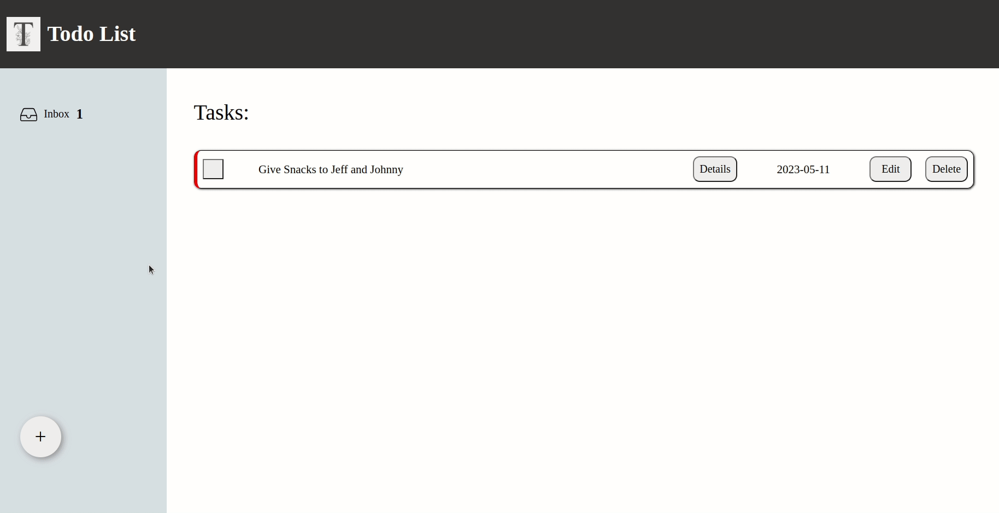

# To-do List Application

[Live Demo](eddomiw.github.io/to-do)

## Short Description :

This to-do list application allows users to create and manage tasks. The application will accept user input to set the task's title, details, due date, and priority level. The priority level will determine the color code of the task for easy identification. The user can also delete tasks or mark them as complete.

## Features :

- Clean UI/UX
- Input validation
- Responsive layout for desktop and laptop applications
- Task management

## Technologies Used :

- SCSS
- JavaScript
- Webpack

## Learning Outcomes:

- Demonstrated proficiency in HTML forms and validation, confirming my understanding of this key component of web development.
- Acquired knowledge of responsive design using CSS Grid and Flexbox, and successfully implemented this approach in my code using Sass for more efficient styling.
- Demonstrated an ability to organize stylesheets using folder structures to improve code clarity and maintainability.
- Developed an understanding of modules in JavaScript, including how to export and import files and use them in combination to create a streamlined index.js file using Webpack.
- Applied the principles of classes and constructors in JavaScript to create objects and us them effectively with getters and setters within event listeners.

## Motivation:

Creating the todo app provided an opportunity to consolidate and expand my knowledge of key web development concepts, including HTML forms, responsive design, and modularization using Webpack. While I successfully implemented three modules in my code, one module contains a lot of code that could potentially be split into multiple modules for improved organization and maintainability. To achieve this, I could explore ways to separate the module's functionality into distinct, reusable pieces and then import them back into the form-info.js module. Despite my efforts, I was unable to effectively separate certain aspects of my form-info.js file into distinct modules, and I plan to continue exploring solutions to this challenge in future projects.
